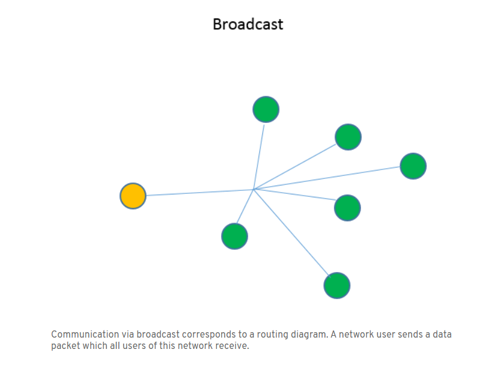
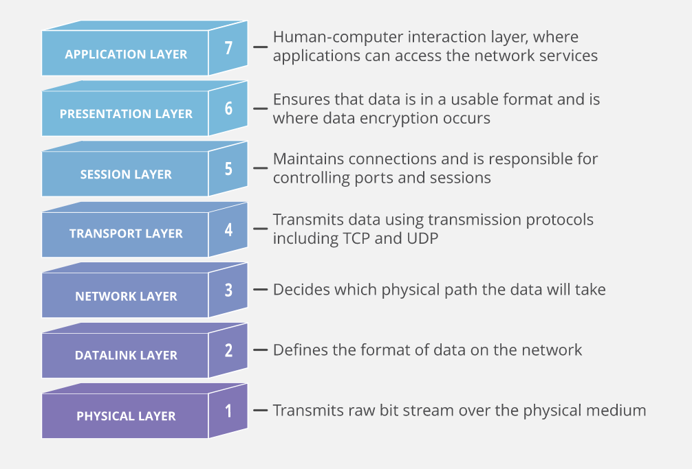
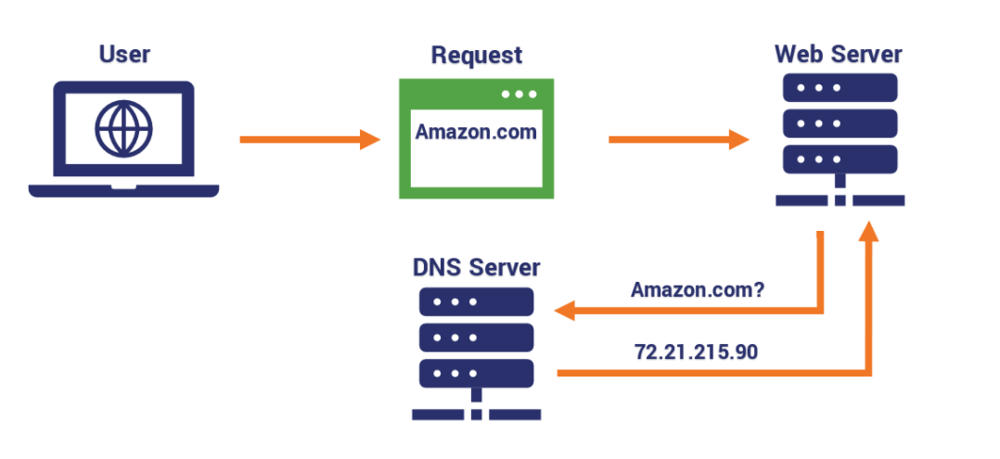
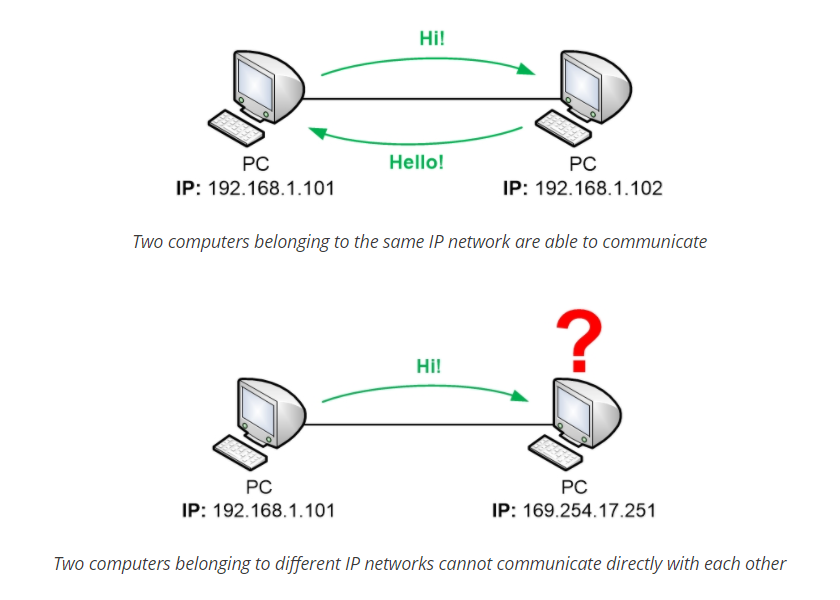

# netwhat
This [project](en.subject.pdf) is an introduction to network problematics

* [What is an IP address](#what_is_an_IP_address)
* [What is a Netmask](#what_is_a_Netmask)
* [What is the subnet of an IP with Netmask](#what_is_the_subnet_of_an_IP_with_Netmask)
* [What is the broadcast address of a subnet](#what_is_the_broadcast_address_of_a_subnet)
* [What are the different ways to represent an ip address with the Netmask](#what_are_the_different_ways_to_represent_an_ip_address_with_the_Netmask)
* [What are the differences between public and private IPs](#what_are_the_differences_between_public_and_private_IPs)
* [What is a class of IP addresses](#what_is_a_class_of_IP_addresses)
* [What is TCP](#what_is_TCP)
* [What is UDP](#what_is_UDP)
* [What are the network layers](#what_are_the_network_layers)
* [What is the OSI model](#what_is_the_OSI_model)
* [What is a DHCP server and the DHCP protocol](#what_is_a_DHCP_server_and_the_DHCP_protocol)
* [What is a DNS server and the DNS protocol](#what_is_a_DNS_server_and_the_DNS_protocol)
* [What are the rules to make 2 devices communicate using IP addresses](#what_are_the_rules_to_make_2_devices_communicate_using_IP_addresses)
* [How does routing work with IP](#how_does_routing_work_with_IP)
* [What is a default gateway for routing](#what_is_a_default_gateway_for_routing)
* [What is a port from an IP point of view and what is it used for when connecting to another device](#what_is_a_port_from_an_IP_point_of_view_and_what_is_it_used_for_when_connecting_to_another_device)

Networks connect devices

the goal of the network is to move information from one device to another

to share information, they must speak the same language -> protocols (instructions of how to handle the information)

## What_is_an_IP_address

[What is an IP Address – Definition and Explanation](https://www.kaspersky.com/resource-center/definitions/what-is-an-ip-address)

An IP (Internet Protocol) address is a **unique address** that identifies a **device** on the internet or a **local network**.

In essence, IP addresses are the **identifier** that **allows information to be sent between devices on a network**: they contain location information and make devices accessible for communication. The internet needs a way to differentiate between different computers, routers, and websites. IP addresses provide a way of doing so and form an essential part of how the internet works.

An IP address is a *string of numbers separated by periods*. IP addresses are expressed as a set of four numbers — an example address might be 192.158.1.38. Each number in the set can *range from 0 to 255*. So, the full IP addressing range goes from 0.0.0.0 to 255.255.255.255.

*IP addresses are not random*. They are mathematically produced and allocated by the Internet Assigned Numbers Authority (IANA), a division of the Internet Corporation for Assigned Names and Numbers (ICANN). ICANN is a non-profit organization that was established in the United States in 1998 to help maintain the security of the internet and allow it to be usable by all. Each time anyone registers a domain on the internet, they go through a domain name registrar, who pays a small fee to ICANN to register the domain.

[video](https://www.youtube.com/watch?v=LIzTo6e4FgY)

[IPV4 32 bits](https://www.youtube.com/watch?v=EDAnsWpOjGM)

---.---.---.---
each part has 8 bits (1 byte)

192.168.0.1 = 11000000.10101000.00000000.00000001

so the maximum value is 255 = 11111111
and the minumiu is 0 = 00000000
(256 possible combinations)
But in the host section there is a catch. We **cannot** use the *firts* or *last* IP address, these are reserved. The first is the network address and the last is a broadcast address, used to send messages to all computers in the network. So we only have 254 usable host in a netmask like *255.255.255.0*.

Each IP network has a so-called Network Address which is the “name” of the IP network. If you wanted to tell somebody which IP network a computer is located within you would always tell them the first (lowest numbered) address on the IP network, which is the **Network Address**.

So in the end, there are 254 available addresses that can be used in a home network (class C). Normally the **home router** will use one of those addresses, and the rest are available for your computers and other devices.

The Internet protocol version 4 (**IPv4**) defines an IP address as a **32-bit** number. Due to the *increasing need* for and using up of available IPv4 addresses, a new IP version (**IPv6**) with **128** bits for the IP address was developed in 1995. It became a standard in December 1998. In July 2017, a final definition of the protocol was published. The IPv6 application has been running since the middle of the 2000s.

## What_is_a_Netmask

A subnet mask is always *paired* with an *IP* adress and is used to *identify* the **network section** and the **host section** of the address.

In its *simplest form* whenever you see *255* this is the *network* part of the address, whenever you see a *0* this is the *host* part os the address. The real way to see wich part is wich, is by looking at the subnet mask binary bits and compating it to the IP address **binary bits**. Anytime you see a **1** value, this bit is the network section anytime you see a **0**, it's the host section.

To be able to look at an IP adress and know wich class it belongs to, the easiest way is to memorize the first octet.

But instead of a full subnet mask, we often see it written as an forward slash and then the number od Network bits.

192.54.103.29 with the netmask 255.255.255.0 = *192.54.103.29/24*

looking to the host part *29* (binary **00011101**), remember the firts (*192.54.103.0*) is the network address and the last (*192.54.103.255*) is a broadcast address.

## What_is_the_subnet_of_an_IP_with_Netmask

A 32-bit IP address uniquely identifies a single device on an IP network. The 32 binary bits are divided into the host and network sections by the subnet mask but they are also broken into four 8-bit octets.

## What_is_the_broadcast_address_of_a_subnet

[What is a broadcast address and how does it work?](https://www.ionos.com/digitalguide/server/know-how/broadcast-address/)

The broadcast address of a subnet is the last combination of the host bit's, reserved for send messages to all devices in the same network (broadcast).

Broadcasting in a computer network is transmitting a message which **does not require a response** to *all users* of the *network*.

One computer in a network sends a data packet to all other users at the same time. The sender does not need to indicate recipient addresses – this is how the broadcast process differs from unicast, where only a single known recipient is addressed. The general advantage of broadcasting is that information can be distributed without having to be transmitted multiple times.

A special address is required to carry out the procedure, which replaces the recipient addresses in question. This broadcast IP is of particular use if the addresses of the individual network users are not known.

The sender initiates the broadcast connection and provides the address at which the recipients can contact them. A broadcast works in a similar way to a mailing list: the recipients are not visible to each other and the sender has no way of knowing the addresses of the network users. Only if the users contact the sender one-to-one do they disclose their own address.

Each network or subnet has a dedicated broadcast address, through which **all users** of the network can *broadcast*.

In a broadcast address, *all the host bits are set to the binary value 1*, so if all host bits are set to the value 0, this is the subnet address.

Example: IPv4 address 192.128.64.7/24

192.128.64.7 is the IP address and 24 is the subnet mask. The **/24** *corresponds* to the subnet mask **255.255.255.0**. The IP address consists of 4 decimals – called octets – which are separated by points. One octet contains 8 bits, which is why IPv4 is a 32-bit address. Each octet can represent a number between 0 and 255. In this case, the **whole of the last octet consists of host bits**. Therefore, in this example, the broadcast address would be *192.128.64.255* – so all host bits at *1*.

Where can you find the broadcast address? The IP address is a 4-digit series of numbers with values from 0 to 255. A *broadcast IP address* is only **assigned once** in each network. It is **always** the *last IP address of the subnet*.

## What_are_the_different_ways_to_represent_an_ip_address_with_the_Netmask

In IPv4 there are three default subnet masks corresponding to the three classes of IP addresses. 
There are currently *three ways* of showing the subnet masks for IPv4 addresses: 
you can show them in dotted decimal, binary, or classless interdomain routing (CIDR). 

**Dotted decimal** consists of a string of decimal numbers, using the full stop (dot) as a separation character, as in **127.0.0.1**.

The **binary** notation for a *Class A* default mask would look like **11111111.00000000.00000000.00000000**.

The **CIDR** (Classless Inter-Domain Routing) notation uses a slash/then the number of *bits that need to be turned on in the mask*. So for a *Class A* it would be **/8**, for *Class B* it would be **/16**, and finally for a *Class C* it would be **/24**.

[subnet-mask](https://www.sciencedirect.com/topics/computer-science/subnet-mask)

## What_are_the_differences_between_public_and_private_IPs

[about public and privete IPs](https://help.keenetic.com/hc/en-us/articles/213965789-What-is-the-difference-between-a-public-and-private-IP-address-)

All IPv4 addresses can be divided into two major groups: **global** (or public, external) - this group can also be called *'WAN addresses'* — those that are used on the Internet, and **private** (or local, internal) addresses — those that are used in the *local network* (LAN).

These are **public** (global) addresses that are **used on the Internet**. 
A public IP address is an IP address that is used to access the Internet. Public IP addresses can be routed on the Internet, unlike private addresses. 

The presence of a public IP address on your router or computer will allow you to organize your own server (VPN, FTP, WEB, etc.), remote access to your computer, video surveillance cameras, and get access to them from anywhere on the global network.

With a public IP address, you can set up any home server to publish it on the Internet: Web (HTTP), VPN (PPTP/IPSec/OpenVPN, WireGuard), media (audio/video), FTP, NAS, game server, etc.

Private (internal) addresses are not routed on the Internet and no traffic can be sent to them from the Internet, they only supposed to work within the local network.

Internet Assigned Numbers Authority (IANA) is the organization responsible for registering IP address ranges to organizations and Internet Service Providers (ISPs). To allow organizations to freely assign private IP addresses, the Network Information Center (InterNIC) has reserved certain address blocks for private use. The following IP blocks are reserved for private IP addresses.

Private addresses include IP addresses from the following subnets:

|				Range					|  Network 		|	Mask 		 		| Hosts			|
|:--------------------------------------| :-------:		| :-------------------:	| ---------:	|
| from 10.0.0.0 to 10.255.255.255 		| 10.0.0.0		|	255.0.0.0 or /8 	|  16.777.216	|
| from 172.16.0.0 to 172.31.255.255		| 172.16.0.0	|	255.240.0.0 or /12	|  1.048.576	|
| from 192.168.0.0 to 192.168.255.255	| 192.168.0.0	|	255.255.0.0 or /16	|  65.536		|

And a special range recommended according to rfc6598 for use as an address pool for CGN (Carrier-Grade NAT)

|				Range					|		Mask 		 	|
|:--------------------------------------| -------------------:	|
| from 100.64.0.0 to 100.127.255.255 	|	255.192.0.0 or /10 	|

Those are reserved IP addresses. These addresses are intended for use in *closed local area networks* and the allocation of such addresses is not globally controlled by anyone.

Direct *access* to the *Internet* from a private IP address is *not possible*. In this case, the connection to the Internet must go through **NAT** (Network Address Translation replaces the private IP address with a public one). Private IP addresses within the same local network must be *unique* and cannot duplicate.

As far as Internet security is concerned, the use of a **private** IP address is **more secure** than the use of a public IP address, as private IP addresses are **not directly visible** on the Internet and are located behind *NAT*, which also ensures the security of the home network. When using a public IP address, measures are required to provide additional security for the computer or server that are exposing their services to the Internet

## What_is_a_class_of_IP_addresses

| Class | Adresseses                  | Bits Network (**n**) Host (*h*) | Networks            | Hosts                   |
|:----- | :--------------------------:| :-----------------------------: | :-----------------: | -----------------------:|
|  A    | 0.0.0.1 - 126.255.255.255   | **n**.*h*.*h*.*h*               | 126 (2^7 -2*)       | 16.777.214 (2^24 - 2*)  |
| B     | 128.0.0.0 - 191.255.255.255 | **n**.**n**.*h*.*h*             | 16.382 (2^14 -2*)   | 65.534 (2^16 - 2*)      |
| C     | 192.0.0.0 - 223.255.255.255 | **n**.**n**.**n**.*h*           | 2.097.150 (2^21 -2*)| 254 (2^8 - 2*)          |
| D     | 224.0.0.0 - 239.255.255.255 | -                               | -                   | Multicast               |
| E     | 240.0.0.0 - 255.255.255.254 | -                               | -                   | experimental tests      |

*firts IP:network last IP:broadcast*

## What_is_TCP

[wikipedia](https://en.wikipedia.org/wiki/Transmission_Control_Protocol)
[TCP-IP](https://www.cloudflare.com/pt-br/learning/ddos/glossary/tcp-ip/)
[whats tcp?](https://www.fortinet.com/br/resources/cyberglossary/tcp-ip)

The *Transmission Control Protocol* (TCP) is one of the main protocols of the Internet protocol suite. It originated in the initial network implementation in which it complemented the Internet Protocol (IP). Therefore, the entire suite is commonly referred to as TCP/IP. TCP provides *reliable, ordered, and error-checked delivery* of a *stream of octets* (bytes) between applications running on hosts communicating via an IP network. Major internet applications such as the World Wide Web, email, remote administration, and file transfer rely on TCP, which is part of the Transport Layer of the TCP/IP suite. SSL/TLS often runs on top of TCP.

The Transmission Control Protocol (TCP) is a communications standard that **enables application programs and computing devices to exchange messages over a network**. It is designed to send packets across the internet and ensure the successful delivery of data and messages over networks.

TCP organizes data so that it can be transmitted between a server and a client. It **guarantees the integrity** of the data being communicated over a network. Before it transmits data, TCP establishes a connection between a source and its destination, which it ensures remains live until communication begins. It then *breaks large amounts of data into smaller packets*, while *ensuring data integrity is in place* throughout the process.

As a result, TCP is used to transmit data from high-level protocols that need all data to arrive. These include peer-to-peer sharing protocols like File Transfer Protocol (FTP), Secure Shell (SSH), and Telnet. It is also used to send and receive email through Internet Message Access Protocol (IMAP), Post Office Protocol (POP), and Simple Mail Transfer Protocol (SMTP), and for web access through the Hypertext Transfer Protocol (HTTP).

TCP and IP are separate protocols that work together to ensure data is delivered to its intended destination within a network. IP obtains and defines the address—the IP address—of the application or device the data must be sent to. TCP is then responsible for transporting data and ensuring it gets delivered to the destination application or device that IP has defined. 

The TCP/IP relationship is similar to sending someone a message written on a puzzle through the mail. The message is written down and the puzzle is broken into pieces. Each piece then can travel through a different postal route, some of which take longer than others. When the puzzle pieces arrive after traversing their different paths, the pieces may be out of order. The Internet Protocol makes sure the pieces arrive at their destination address. The TCP protocol can be thought of as the puzzle assembler on the other side who puts the pieces together in the right order, asks for missing pieces to be resent, and lets the sender know the puzzle has been received. TCP maintains the connection with the sender from before the first puzzle piece is sent to after the final piece is sent.

The four layers of the TCP/IP model are as follows:

**Datalink layer:** The datalink layer defines how data should be sent, handles the physical act of sending and receiving data, and is responsible for transmitting data between applications or devices on a network. This includes defining how data should be signaled by hardware and other transmission devices on a network, such as a computer’s device driver, an Ethernet cable, a network interface card (NIC), or a wireless network. It is also referred to as the link layer, network access layer, network interface layer, or physical layer and is the combination of the physical and data link layers of the Open Systems Interconnection (OSI) model, which standardizes communications functions on computing and telecommunications systems.

**Internet layer:** The internet layer is responsible for sending packets from a network and controlling their movement across a network to ensure they reach their destination. It provides the functions and procedures for transferring data sequences between applications and devices across networks.

**Transport layer:** The transport layer is responsible for providing a solid and reliable data connection between the original application or device and its intended destination. This is the level where data is divided into packets and numbered to create a sequence. The transport layer then determines how much data must be sent, where it should be sent to, and at what rate. It ensures that data packets are sent without errors and in sequence and obtains the acknowledgment that the destination device has received the data packets.

**Application layer:** The application layer refers to programs that need TCP/IP to help them communicate with each other. This is the level that users typically interact with, such as email systems and messaging platforms. It combines the session, presentation, and application layers of the OSI model.

## What_is_UDP

An alternative to TCP is the *User Datagram Protocol* (UDP), which is used to establish low-latency connections between applications and speed up transmissions. TCP can be an expensive network tool as it includes absent or corrupted packets and protects data delivery with controls like acknowledgments, connection startup, and flow control. 

*UDP does not provide error connection or packet sequencing nor does it signal a destination before it delivers data*, which makes it **less reliable** but **less expensive**. As such, it is a good option for time-sensitive situations, such as Domain Name System (DNS) lookup, Voice over Internet Protocol (VoIP), and streaming media.

The User Datagram Protocol, or UDP, is a communication protocol used across the Internet for especially time-sensitive transmissions such as video playback or DNS lookups. It speeds up communications by not formally establishing a connection before data is transferred. This allows data to be transferred **very quickly**, but it can also **cause packets to become lost in transit** — and create **opportunities for exploitation** in the form of DDoS attacks.

## What_are_the_network_layers

[network layers explained](https://www.plixer.com/blog/network-layers-explained/)

While TCP/IP is the newer model, the Open Systems Interconnection (OSI) model is still referenced a lot to describe network layers. The **OSI model** was developed by the International Organization for Standardization. There are 7 layers:

1. **Physical** (e.g. cable, RJ45) - Actual hardware sits at this layer. It transmits signals over media. This layer includes the physical equipment involved in the data transfer, such as the cables and switches. This is also the layer where the data gets converted into a bit stream, which is a string of 1s and 0s. The physical layer of both devices must also agree on a signal convention so that the 1s can be distinguished from the 0s on both devices.

2. **Data Link** (e.g. MAC, switches) - Translates binary (or BITs) into signals and allows upper layers to access media. The data link layer is very similar to the network layer, except the data link layer facilitates data transfer between two devices on the SAME network. The data link layer takes packets from the network layer and breaks them into smaller pieces called frames. Like the network layer, the data link layer is also responsible for flow control and error control in intra-network communication (The transport layer only does flow control and error control for inter-network communications).

3. **Network** (e.g. IP, routers) - This layer determines how data is sent to the receiving device. It’s responsible for packet forwarding, routing, and addressing. The network layer is responsible for facilitating data transfer between two different networks. If the two devices communicating are on the same network, then the network layer is unnecessary. The network layer breaks up segments from the transport layer into smaller units, called packets, on the sender’s device, and reassembling these packets on the receiving device. The network layer also finds the best physical path for the data to reach its destination; this is known as routing.

4. **Transport** (e.g. TCP, UDP, port numbers) - This layer coordinates data transfer between system and hosts, including error-checking and data recovery. The transport layer is also responsible for flow control and error control. Flow control determines an optimal speed of transmission to ensure that a sender with a fast connection doesn’t overwhelm a receiver with a slow connection. The transport layer performs error control on the receiving end by ensuring that the data received is complete, and requesting a retransmission if it isn’t.

5. **Session** (e.g. Syn/Ack) - This layer establishes and terminates connections between devices. It also determines which packets belong to which text and image files.The session layer also synchronizes data transfer with checkpoints. For example, if a 100 megabyte file is being transferred, the session layer could set a checkpoint every 5 megabytes. In the case of a disconnect or a crash after 52 megabytes have been transferred, the session could be resumed from the last checkpoint, meaning only 50 more megabytes of data need to be transferred. Without the checkpoints, the entire transfer would have to begin again from scratch.

6. **Presentation** (e.g. encryption, ASCII, PNG, MIDI) - This layer converts data to and from the Application layer. In other words, it translates application formatting to network formatting and vice versa. This allows the different layers to understand each other. Finally the presentation layer is also responsible for compressing data it receives from the application layer before delivering it to layer 5. This helps improve the speed and efficiency of communication by minimizing the amount of data that will be transferred.

7. **Application** (e.g. SNMP, HTTP, FTP) - Most of what the user actually interacts with is at this layer. Web browsers and other internet-connected applications (like Skype or Outlook) use Layer 7 application protocols. But it should be made clear that client software applications are not part of the application layer; rather the application layer is responsible for the protocols and data manipulation that the software relies on.

mnemonic devices to memorize the OSI network layers: 

*“All People Seem To Need Data Processing.”* (bottom to top)
*“Please Do Not Throw Sausage Pizza Away.”* (top to bottom)

The TCP/IP model is a more concise framework, with only 4 layers:

1. **Network Access** (or Link) - Also called the Link or Network Interface layer. This layer combines the OSI model’s L1 and L2.
2. **Internet** - This layer is similar to the OSI model’s L3.
3. **Transport** (or Host-to-Host) - Also called the Host-to-Host layer. This layer is similar to the OSI model’s L4.
4. **Application** (or Process) - Also called the Process layer, this layer combines the OSI model’s L5, L6, and L7.

mnemonic device for the TCP/IP model: 
*“Armadillos Take In New Ants.”*

## What_is_the_OSI_model

[the OSI model](https://www.cloudflare.com/learning/ddos/glossary/open-systems-interconnection-model-osi/)

The Open Systems Interconnection (OSI) model is a conceptual model created by the International Organization for Standardization which enables diverse communication systems to communicate using standard protocols. In plain English, the OSI provides a **standard** for **different computer systems** to **be able to communicate with each other**.

The OSI model can be seen as a **universal language for computer networking**. It’s based on the concept of splitting up a communication system into seven abstract layers, each one stacked upon the last.

Although the modern Internet doesn’t strictly follow the OSI model (it more closely follows the simpler Internet protocol suite), the OSI model is *still very useful for troubleshooting* network problems. Whether it’s one person who can’t get their laptop on the Internet, or a web site being down for thousands of users, the OSI model can help to break down the problem and isolate the source of the trouble. If the problem can be narrowed down to one specific layer of the model, a lot of unnecessary work can be avoided.

> Real world example from OSI layers: Mr. Cooper wants to send Ms. Palmer an email. Mr. Cooper composes his message in an email application on his laptop and then hits ‘send’. His email application will pass his email message over to the application layer, which will pick a protocol (SMTP) and pass the data along to the presentation layer. The presentation layer will then compress the data and then it will hit the session layer, which will initialize the communication session.
>
>The data will then hit the sender’s transportation layer where it will be segmented, then those segments will be broken up into packets at the network layer, which will be broken down even further into frames at the data link layer. The data link layer will then deliver those frames to the physical layer, which will convert the data into a bitstream of 1s and 0s and send it through a physical medium, such as a cable.
>
>Once Ms. Palmer’s computer receives the bit stream through a physical medium (such as her wifi), the data will flow through the same series of layers on her device, but in the opposite order. First the physical layer will convert the bitstream from 1s and 0s into frames that get passed to the data link layer. The data link layer will then reassemble the frames into packets for the network layer. The network layer will then make segments out of the packets for the transport layer, which will reassemble the segments into one piece of data.
>
>The data will then flow into the receiver's session layer, which will pass the data along to the presentation layer and then end the communication session. The presentation layer will then remove the compression and pass the raw data up to the application layer. The application layer will then feed the human-readable data along to Ms. Palmer’s email software, which will allow her to read Mr. Cooper’s email on her laptop screen.

## What_is_a_DHCP_server_and_the_DHCP_protocol

A DHCP Server is a network server that automatically provides and assigns IP addresses, default gateways and other network parameters to client devices. It relies on the standard protocol known as Dynamic Host Configuration Protocol or DHCP to respond to broadcast queries by clients.

[wikipedia](https://en.wikipedia.org/wiki/Dynamic_Host_Configuration_Protocol)

The **Dynamic Host Configuration Protocol** (DHCP) is a *network management protocol* used on Internet Protocol (**IP**) local area networks. A DHCP server must be present on the network. A device connected to the network requests an IP address *from* the **DHCP server** using the **DHCP protocol**; the server assigns a *unique address* to the device, **identifying** it for TCP/IP communication, and supplies *other network configuration parameters*. In the absence of a DHCP server, a device that needs an IP address must be manually assigned a static address by a network administrator, or must assign itself an APIPA address (which will not enable it to communicate outside its local subnet). A device configured to use dynamic (DHCP) addressing that is connected to a different network will be assigned an address on that network without needing to be reconfigured. However if the address of a device must be known—for example, a printer which processes print jobs sent to its IP address—a known static address is required.

DHCP can be implemented on networks ranging in size from home networks to large campus networks and regional ISP networks.*Many routers and residential gateways can act as DHCP servers*. Most residential network routers receive a globally unique IP address within the ISP network. Within a **local network**, a DHCP server assigns a **local IP address** to each device connected to the network.

## What_is_a_DNS_server_and_the_DNS_protocol

[whats DNS](https://www.cloudflare.com/learning/dns/what-is-dns/)

The Domain Name System (DNS) is the **phonebook of the Internet**. Humans access information online through domain names, like nytimes.com or espn.com. Web browsers interact through Internet Protocol (IP) addresses. **DNS translates domain names to IP addresses** so browsers can load Internet resources.

Each device connected to the Internet has a unique IP address which other machines use to find the device. DNS servers **eliminate the need** for humans to **memorize IP addresses** such as 192.168.1.1 (in IPv4), or more complex newer alphanumeric IP addresses such as 2400:cb00:2048:1::c629:d7a2 (in IPv6).

The process of DNS resolution involves converting a hostname (such as www.example.com) into a computer-friendly IP address (such as 192.168.1.1). An IP address is given to each device on the Internet, and that address is necessary to find the appropriate Internet device - like a street address is used to find a particular home. When a user wants to load a webpage, a translation must occur between what a user types into their web browser (example.com) and the machine-friendly address necessary to locate the example.com webpage.

## What_are_the_rules_to_make_2_devices_communicate_using_IP_addresses

[IP adresses](https://www.homenethowto.com/basics/ip-addresses/#:~:text=Computers%20that%20belong%20to%20different,each%20other%20via%20a%20router.&text=An%20IP%20address%20is%20divided,forward%20traffic%20towards%20different%20destinations.)

On a computer network, all devices that are connected to the same local network can *talk directly with each other*. But to do so they need to have *IP addresses* that **belong to the same IP network**. Computers that belong to *different IP networks* have to communicate with each other via a **router**.

The **main purpose** of a router is *to be able to forward traffic towards different destinations*. A router **keeps track** of where different IP networks exist on the computer network. The main task of the router is to *forward traffic between those IP networks*.

## How_does_routing_work_with_IP

IP Routing describes the **process of determining the path** for data to follow in order to **navigate from one computer or server to another**. A packet of data traverses from its source router through a web of routers across many networks until it finally reaches its destination router using a **routing algorithm**. The routing algorithm takes into account factors such as the *size of a packet* and its header to determine the *most efficient route* to the destination. When a packet has reached a router, the source and destination address of the packet are used in conjunction with a *routing table* (list that contains the routes to a certain network) to determine the next hop address. This process is repeated for the next router using its own routing table until the packet has reached its destination. Because the data is divided into packets, **each packet travels independently from each other** and is treated as such. As a result, each packet can be sent through a different route to the destination if necessary.

## What_is_a_default_gateway_for_routing

[understanding default routes](https://www.juniper.net/documentation/en_US/junos/topics/concept/default-route-understanding.html)

A **default route** is the route that takes effect when **no other route is available** for an IP destination address.

If a packet is received on a routing device, the device first checks to see if the IP destination address is on one of the *device’s local subnets*. If the destination address is not local, the device checks its *routing table*. If the remote destination subnet is not listed in the routing table, the packet is **forwarded to the next hop toward the destination using the default route**. The default route generally has a next-hop address of another routing device, which performs the same process. The process repeats until a packet is delivered to the destination.

The route evaluation process in each router uses the longest prefix match method to obtain the most specific route. The network with the longest subnet mask that matches the destination IP address is the next-hop network gateway.

The default route in IPv4 is designated as 0.0.0.0/0 or simply 0/0. Similarly, in IPv6, the default route is specified as ::/0. The subnet mask /0 specifies all networks, and is the shortest match possible. A route lookup that does not match any other route uses this route if it is configured and active in the routing table. To be active, the configured next-hop address must be reachable.

Administrators generally point the default route toward the routing device that has a connection to a network service provider. Therefore, packets with destinations outside the organization's local area network, typically destinations on the Internet or a wide area network, are forwarded to the routing device with the connection to that provider. The device to which the default route points is often called the default gateway.	

## What_is_a_port_from_an_IP_point_of_view_and_what_is_it_used_for_when_connecting_to_another_device

[wikipedia](https://en.wikipedia.org/wiki/Port_(computer_networking))
[what is a port?](https://whatismyipaddress.com/port?__cf_chl_jschl_tk__=aeb667864533e7bcf5d96877cd38fd618425d257-1614555118-0-AcT09XkLDEEoB_LhPz-7_NYNGrb5H-6oSuM-h4MlQAtx3Y8IauJTSU8ZNAH9S75zAfd30Iq8nAjy1PMJfjZDjHCBAzeobVKzz0aQT014UsPZXVWdfiO3pPXa_Dr2cCRbzmCCB0qlRqzjZdO5WcYruez1ztyQjgxqgVWpofCMlBLAHl3mSq_M_aKMeOYPiw-M0Q67HWS_0_d4eYGiN9lBhEYeJdUo3J2pEBPwoZszgnwKUIRiYJ-B3bU2mkWKDP2RBWqO8i3FgFfxKsJztxp9EtAqC3DngajD96dpciteUpj7d9VZCv5Uw_yjVcCxg8uxbtyz2IFt_eqB5OkwhLrR198OfpQ9IOxludL7YnmdGpXRhk4EFOuFZtD_qC4fQ447Qw)

In computer networking, a port is a **communication endpoint**. At the software level, within an operating system, a port is a logical construct that identifies a specific process or a type of network service. A port is *identified* for each *transport protocol* and address combination by a *16-bit unsigned number*, known as the *port number*. The most common transport protocols that use port numbers are the Transmission Control Protocol (**TCP**) and the User Datagram Protocol (**UDP**).

A **port number** is **always associated** with an **IP address** of a host and the **type of transport protocol** used for communication. It completes the destination or origination network address of a message. Specific port numbers are reserved to identify specific services so that an arriving packet can be easily forwarded to a running application. For this purpose, port numbers lower than 1024 identify the historically most commonly used services and are called the well-known port numbers. Higher-numbered ports are available for general use by applications and are known as ephemeral ports.

Ports provide a multiplexing service for multiple services or multiple communication sessions at one network address. In the client–server model of application architecture, multiple simultaneous communication sessions may be initiated for the same service.

>Picture a bay where there are lots of private boats are docked. The overall location is called a seaport, literally a port at or on the sea. Everyone wanting to dock there—requesting landing services—uses the same port. Seaports work with berth numbers assigned to individual boats. The port name and the berth number combine into the “who, what, and where” of boat identification.
>
>In geek-speak, berth numbers on the Internet are Internet Protocol or IP addresses, a user’s numerical identifier on the Internet. Depending on the connection type and service provider, a user’s IP address may or may not remain the same with each connection to or “docking” on the Internet.
>
>A computer port is a type of electronic, software- or programming-related docking point through which information flows from a program on your computer or to your computer from the Internet or another computer in a network. (A network, by the way, is a series of computers that are physically or electronically linked.)

In computer terms, a computer or a program connects to somewhere or something else on the Internet via a port. Port numbers and the user’s IP address combine into the “who does what” information kept by every Internet Service Provider.

Ports are numbered for consistency and programming. The most commonly used and best-known ports are those numbered 0 to 1023 dedicated for Internet use, but they can extend far higher for specialized purposes. Each port set or range is assigned specialized jobs or functions, and that’s generally all they do. Usually, all identical system services or functions use the same port numbers on the receiving servers.
